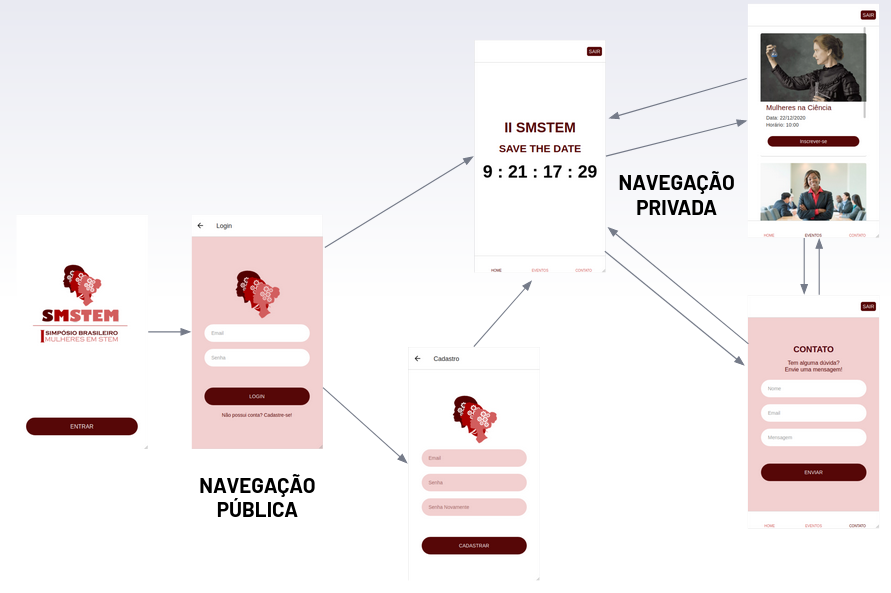

# Symposium App - Versão Web


#### O projeto consiste em um template de aplicação para suporte da organização de simpósios acadêmicos. Fornece uma infraestrutura mínima para divulgação do evento e gerenciamento das inscrições. A aplicação foi pensada para se adequar aos padrões de uma *Single Page Application* (SPA) com interface ituitiva para os possíveis participantes do evento. 

#### A proposta contempla um frontend adequado aos própositos. As funcionalidades básicas de visualização do conteúdo informativo, de login e cadastro de participantes é realizada de forma consistente. De forma complementar, o backend também trata de forma adequada as interações com o banco de dados, organiza as rotas da aplicação, gerencia validações e autenticações, além de incluir mitigação de algumas vulnerabilidades a que a aplicação estará sujeita em ambiente web.

#### Como display *default* tem-se o "I Simpósio Brasileiro Mulheres em STEM", ocorrido no ITA no início de 2020.

## Fluxo de Interação do Usuário
No contexto de Single Page Application e seguindo o planejamento que vem sendo executado no decorrer da realização do projeto é interessante dar continuidade à validação das funcionalidades. Uma forma procedural desse acompanhamento (e que constitui um elemento de metodologias ágeis) e checagem do fluxo de uso é através de **User Stories**. Algumas podem ser indicadas a seguir:

**"Como visitante do site, eu quero ...**

 * obter informações gerais do evento para decidir sobre minha participação"
 * obter uma prévia da programação para melhor escolha de palestras"
 * realizar um cadastro simples no site para me inscrever"
 * poder facilmente me inscrever como ouvinte do simpósio para assistir as palestras"
 * poder facilmente me inscrever como apresentador do simpósio para além de assitir palestras, apresentar meu trabalho acadêmico"
 * ter acesso a "perguntas frequentes" para resolver dúvidas básicas"
 * poder entrar em contato com os administradores para tirar dúvidas específicas"
    
**"Como administrador do site, eu quero ...**
    
 * oferecer uma interface intuitiva para atrair participantes"
 * proteção mínima contra vulnerabilidades para maior confiabilidade na interação com os usuários"
 * aplicação no formato de template para fácil reaproveitamento"

Cada item, naturalmente, resulta em desdobramentos de implementação que fizeram parte das etapas de execução do projeto. Apesar de a metodologia ágil não ter sido aplicada integralmente, é interessante validar o benefício atingido com essa adaptação no contexto de levantamento de requisitos.

## Como utilizar o projeto
#### 1. Para o front-end

###### Acesse o diretório *./frontend*
```shell
npm i
npm run build
npm start
```
###### *Frontend* deverá ser executado em *http://localhost:3006/#home*

#### 2. Para o back-end

###### Acesse o diretório *./backend*
```shell
npm i
node index.js
```
###### *Backend* deverá ser executado em *http://localhost:4000/*

## Organização do Projeto

#### *./frontend*
##### Contém os arquivos relacionados ao *frontend* da aplicação.
* package.json: são os *requirements* da seção
* /src/Components: contém as definições dos *React class components* utilizados
* /src/Services: contém os serviços de autenticação com usuários
* /src/App.js: arquivo principal de montagem da página

#### *./backend*
##### Contém os arquivos relacionados ao *backend* da aplicação.
* package.json: são os *requirements* da seção
* databse.sql: script base para as tabelas do banco de dados PostgreSQL
* db.js: conexão com o banco de dados PostgreSQL
* index.js: contém as rotas do *back*
* auth.js: estratégia local de autenticação de usuários
* utils.js: contém algumas funções auxiliares úteis ao backend

## Estrutura Principal do Projeto
    ├── backend                         # diretório do servidor do backend da aplicacao web
      ├── auth.js                       # estrategia de autenticacao local para login
      ├── database.sql                  # inicializacao do banco de dados
      ├── db.js                         # conexao com o banco de dados
      ├── index.js                      # configuracao do servidor do backend e definicao das rotas
      ├── utils.js                      # funções auxiliares
    ├── frontend                        # diretorio do frontend da aplicacao web 
      ├── public                        # conteudo estático básico de estilo
        ├── css                         # estilos externos do template
        ├── images                      # imagens da página
      ├── src                           # codigos fonte
        ├── Components                  # componentes react para as sessoes do SPA
          ├── About.js                  
          ├── Contact.js                
          ├── Countdown.js              
          ├── Faq.js                    
          ├── Footer.js                 
          ├── Header.js                 
          ├── Login.js                  
          ├── Map.js                    
          ├── Register.js              
          ├── RegisterModal.js          
          ├── Schedule.js               
          ├── Speaker.js                
          ├── SubscribeListener.js     
          ├── SubscribePresenter.js     
          ├── Subscription.js           
        ├── Images                      # imagens da pagina (conteudo mutavel)
        ├── Services                    # servicos auxiliares
          ├── AuthService.js            # servico de autenticacao do login
        ├── App.js                      # definicao do single page app
        ├── index.js                    # entry point do front end

    
## Banco de Dados
O design do banco de dados é voltado para o suporte do gerenciamento de usuários relacionados ao potencial evento acadêmico. Foi utilizado o PostgreSQL pela flexibilidade de utilização, além de ser um dos gerenciadores padrão da indústria. O esquema a seguir resume a estrutura implementada.


Exitem, basicamente, três instâncias em que o usuário estará presente: há a tabela de usuários contendo algumas informações básicas e existem tabelas para identificação dos dois perfis de indivíduos inscritos, uma vez que um participante pode ser ouvinte ou apresentador no evento. Além disso foi definida uma tabela para armazenamento das mensagens de contato enviadas por visitantes da página.

## Segurança da Aplicação
Quase que a totalidade das aplicações está sujeita a ataques maliciosos que exploram vulnerabilidades. No caso de aplicações web o problema se torna mais crítico pela própria condição de conexão à Internet que cria espaço para abertura dos acessos.

No contexto do projeto foram implementadas táticas de mitigação para algumas vulnerabilidades como: cross-site scripting (XSS), cross-site request forgery (CSRF), clickjacking, SQL injection. A base da implementação das estratégias em questão foram baseadas em frameworks como o Helmet e o csurf. Observemos um adescrição básica:

* XSS: aplicação de um filtro do Helmet para ajuste do comportamento do browser
* CSRF: utilização do csurf para gerar tokens para validação e que são passados para o formulários da aplicação
* Clickjacking: uso de um frameguard do Helmet e checagem de margens no JavaScript
* SQL Injection: validação das informações (frontend e backend) antes de qualquer query ser passada ao banco de dados

Além disso, foi aplicada uma estratégia de criptografia em campos sensíveis, como é o caso da senha dos usuários, para a qual toda validação e armazenamento no banco de dados é feita a partir da aplicação de uma função de hash. Pode-se citar que também foi configurada uma política de segurança do Helmet (*contentSecurityPolicy*) para cobrir casos adicionais.

## Autenticações na Aplicação
Ainda no contexto de segurança da aplicação é interessante que seja realizada autenticação do usuário logado. Além de conferir maior robustez ao sistema, a autenticação visa proteger rotas restritas e assegura o login de um usuário válido. Utilizando como base o framework Passport do Node.js foi implementada uma estratégia local de autenticação. Os tratamentos da autenticação e da definição da estratégia local podem ser identificados no arquivo *backend/index.js*.

Também foi proposta uma autenticação alternativa utilizando um serviço externo. Aplicando o protocolo OAth2.0 foi indicada a possibilidade de o usuário se conectar a partir de sua conta Google. No Google Cloud Platform foi criado um projeto e configurado o serviço de autenticação para que houvesse o suporte desejado à aplicação.

## Validações na Aplicação
Foram aplicadas diversas estratégias de validação na aplicação. Conforme pode ser observado no presente projeto, deve haver coerência dos requests da aplicação com a estrutura definida no banco de dados. Os tipos de dados dos campos e obrigatoriedade do preenchimento devem ser verificados nas queries propostas de interação com o banco de dados relacional. Unicidade das colunas adicionadas também são um fator importante. A grande maioria dessas verificações estão presentes no próprio arquivo de definição das rotas, em *backend/index.js*. Naturalmente, os formulários definidos nos componentes (frontend) também devem estar de acordo com a modelagem adotada.

## Fluxo de navegação da versão mobile

#### *./mobile-app*
##### Contém os arquivos relacionados à versão mobile da aplicação.
* package.json: são os *requirements* da seção
* App.js:
* app.json:
* /screens:

# Symposium App - Versão Mobile

A versão mobile do Symposium App foi desenvolvida com foco nos inscritos do evento. Seu objetivo é trazer mais informações do simpósio para o inscrito, como um catálogo detalhado dos possíveis eventos que o usuário pode atender e uma seção em que o usuário pode tirar dúvidas com a organização do simpósio.

## Como utilizar o projeto
###### Acesse o diretório *./mobile-app*
```shell
npm i
expo start
```
###### *Utilizando o aplicativo Expo Client, basta acessar o QRCode gerado com seu smartphone*
###### A versão mobile da aplicação é uma das partes centrais do projeto.


## Estrutura Principal do Projeto

├── mobile-app                      # diretorio da versao mobile
    ├── assets                      # imagens do app
    ├── screens                     # telas do app
        ├── Contact
            ├── Contact.js  
        ├── Events
            ├── Events.js
            ├── MyCard.js  
        ├── Home
            ├── Clock.js
            ├── Home.js 
        ├── Landing
            ├── Landing.js
        ├── Profile
            ├── Profile.js
        ├── SignIn
            ├── SignIn.js
        ├── SignUp
            ├── SignUp.js
    ├── App.js                      # definicao do app

## Fluxo de Navegação

Houve uma preocupação para implementar restrições de navegação no aplicativo, definindo telas que são de navegação pública e outras que são de navegação privada. 

O aplicativo é composto pelas seguintes telas:

1. Landing page
2. Login
3. SignUp
4. Home
5. Cátalogo de eventos
6. Contato

O fluxo de navegação entre essas telas está apresenta no esquemático abaixo:


Basicamente, as três primeiras telas são consideradas públicas e, portanto, qualquer usuário consegue acessá-las. Já as três últimas telas só podem ser acessadas pelo usuário após realizado o seu processo de autenticação.

## Ações Redux implementadas

- `SUBSCRIBE`: inscreve o usuário em um evento pertencente ao catálogo de eventos.
- `UNSUBSCRIBE`: desinscreve o usuário em um evento pertencente ao catálogo de eventos.
